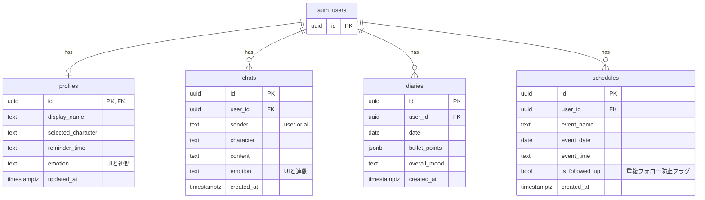

# 🫧 Pico（ピコ）— AI話し相手アプリ

> ポケットからぴこっと顔を出して、今日のあなたに話しかけてくれる。

一人暮らしの孤独を和らげる、AI話し相手Webアプリです。  
チャットで日常を話すだけで、**予定の自動登録・日記の自動生成・フォローアップ**まで全自動でやってくれます。

---

## 💡 開発背景（プロダクトへの想い）

* **身近な人にも言えない「本音」の居場所**：仕事などで本当にしんどい時、家族や友人に気を遣ってしまったり、正論のアドバイスを恐れて本音を打ち明けられない課題を解決したいと考えました。
* **「カッコつけない日記」による内省**：白紙の日記を前にすると気恥ずかしさから自分を飾ってしまいがちです。「気を遣わずにチャットで吐き出すだけで、そのまま生の日記になる」体験を目指しました。

---

## 🎨 徹底した心理的デザイン（こだわりポイント）

### 1. 会話がそのまま日記になる（メイン機能）
チャット履歴を裏側でGeminiが要約し、箇条書きの日記を自動生成します。プロンプトで**「明日はいい日になる」系の空虚な励まし（おためごかし）を明示的に禁止**し、本音ベースのリアルな内省ログになるよう設計しています。

### 2. 文脈を覚えているフォローアップ
会話から「明日」「木曜日」などの相対的な日時をGeminiが計算しカレンダーへ自動登録。予定当日以降に「〇〇どうだった？」と**能動的にフォローアップ**を投げます。

### 3. 感情に応じたビジュアルフィードバック × 依存防止設計
AIの感情（happy / sad / relaxed / angry / normal）に応じて、アバターの枠線色・アニメーション・感情バッジをリアルタイムに切り替え。また、過度なAI依存を防ぐため、キャラは人間ではなく「クラゲ・マシュマロ・サボテン」のような**無機質になりすぎないモチーフ**にデザインしました。

### 4. APIエラーに強いフォールバック構成
Gemini APIの呼び出しは3段階のフォールバック構成にしており、上位モデルで失敗しても自動的に切り替わって高い可用性を担保し、応答を継続します。

その他の工夫（クリックで展開）

- 音声入力対応（Web Speech API）
- ローカルストレージの旧キャッシュを自動クリーンアップし、型不整合によるクラッシュを防止
- 予定の重複自動登録防止（同日・同名の予定は再登録しない）

---

## ✨ 機能と技術スタック

### 🗨️ AIキャラクター一覧

| キャラ | 種族 | 性格・特徴 |
|---|---|---|
| くらら | クラゲ | ゆるっとのんびり・世話焼き |
| まろ | マシュマロ | だらーん共感系・ちょっとシニカル |
| フレデリカ | サボテン | 元気ポジティブ・応援団 |

### 🛠️ 技術スタック

| 分類 | 技術 |
|---|---|
| フロントエンド | Next.js (App Router), Tailwind CSS |
| 認証・DB | Supabase (Auth / PostgreSQL) |
| AI API | Google Gemini API（3段階フォールバック構成） |
| ホスティング | Vercel |

**Geminiフォールバック構成:**
`gemini-3.5-flash`（プライマリ）→ `gemini-3.1-flash-lite`（フォールバック）→ `gemini-2.5-flash`（バックアップ）

---

## 🗄️ DB構成 (Supabase)

> `profiles`, `chats`, `diaries`, `schedules` はいずれも Supabase の `auth.users` を直接参照する構成（`profiles` を親にしたリレーションではない）。

---

## 📱 画面一覧

| 画面 | 内容 |
|---|---|
| ホーム | キャラの挨拶、今日の予定、最近の日記プレビュー |
| おしゃべり | AIキャラとのチャット（感情連動エフェクト、音声入力対応） |
| 予定表 | 登録されたスケジュールをカレンダー形式で確認（手動登録可） |
| 日記 | AI生成の日記一覧・詳細・編集 |
| ピコ設定 | プロフィール編集・話しかける時間設定・キャラクター選択 |

---