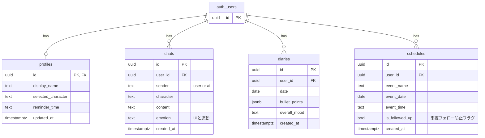

# 🫧 Pico（ピコ）— AI話し相手アプリ

> ポケットからぴこっと顔を出して、今日のあなたに話しかけてくれる。

チャットで日常を話すだけで、**予定の自動登録・日記の自動生成・フォローアップ**まで全自動でやってくれる、AI話し相手Webアプリです。

<!--
  ここにスクリーンショットまたはGIFを1〜3枚挿入してください。
  例：
  
  
  最初の3秒で「何のアプリか」が伝わることが最重要です。
-->

🔗 **Demo:** [https://pico-app.vercel.app](https://pico-app.vercel.app) <!-- Vercelデプロイ後にURLを差し替え -->

---

## 💡 なぜ作ったか

しんどい時ほど、家族や友人には気を遣って本音を言えない。日記も、白紙のノートを前にすると自分を飾ってしまう。

**「気を遣わずに吐き出すだけで、それがそのまま日記になる」**——そんな体験を作りたくて開発しました。

---

## ✨ こだわったポイント

### 1. 会話がそのまま日記になる（メイン機能）
チャット履歴をGeminiが裏側で要約し、箇条書きの日記を自動生成します。プロンプトで**「明日はいい日になる」系の空虚な励まし（おためごかし）を明示的に禁止**し、本音ベースのリアルな内省ログになるよう設計しています。

### 2. 文脈を覚えているフォローアップ
「明日」「木曜日」のような相対的な日時表現をGeminiが解釈し、予定として自動でカレンダーに登録。予定当日以降、会話の中で自然に「〇〇どうだった？」と聞き返してくれます。

### 3. 感情に応じたビジュアルフィードバック
AIの感情（happy / sad / relaxed / angry / normal）に応じて、アバターの枠線色・アニメーション・バッジをリアルタイムに切り替え。AI依存を助長しないよう、キャラは人間ではなく「クラゲ・マシュマロ・サボテン」のような無機質になりすぎないモチーフにしています。

### 4. APIエラーに強いフォールバック構成
Gemini APIの呼び出しは3段階のフォールバック構成にしており、上位モデルで失敗しても自動的に切り替わって応答を継続します（詳細は下記）。

その他の工夫（クリックで展開）

- 音声入力対応（Web Speech API）
- ローカルストレージの旧キャッシュを自動クリーンアップし、型不整合によるクラッシュを防止
- 予定の重複自動登録防止（同日・同名の予定は再登録しない）

---

## 🗨️ AIキャラクター

| キャラ | 種族 | 性格 |
|---|---|---|
| くらら | クラゲ | ゆるっとのんびり・世話焼き |
| まろ | マシュマロ | だらーん共感系・ちょっとシニカル |
| フレデリカ | サボテン | 元気ポジティブ・応援団 |

---

## 🛠️ 技術スタック

| 分類 | 技術 |
|---|---|
| フロントエンド | Next.js (App Router), Tailwind CSS |
| 認証・DB | Supabase (Auth / PostgreSQL) |
| AI API | Google Gemini API（3段階フォールバック構成） |
| ホスティング | Vercel |

**Geminiフォールバック構成:**
`gemini-3.5-flash`（プライマリ）→ `gemini-3.1-flash-lite`（フォールバック）→ `gemini-2.5-flash`（バックアップ）

---

## 🗄️ DB構成

> `profiles`, `chats`, `diaries`, `schedules` はいずれも Supabase の `auth.users` を直接参照する構成（`profiles` を親にしたリレーションではない）。

---

## 📱 画面一覧

| 画面 | 内容 |
|---|---|
| ホーム | キャラの挨拶、今日の予定、最近の日記プレビュー |
| おしゃべり | AIキャラとのチャット（感情連動エフェクト、音声入力対応） |
| 予定表 | 登録されたスケジュールをカレンダー形式で確認（手動登録可） |
| 日記 | AI生成の日記一覧・詳細・編集 |
| ピコ設定 | プロフィール編集・話しかける時間設定・キャラクター選択 |
